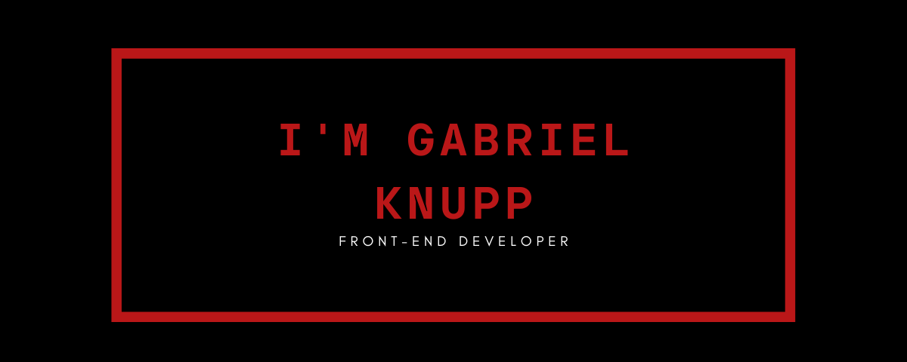

<h1 align="center">Hi guys :metal: ! Welcome to my profile</h1>
  

     
<h3 align="center">Languages and Tools</h3>
 

  
  
  
  
     
  
  
    
     
     

 
 
<h3 align="center">Connect with me</h3>
 

  
  &nbsp;&nbsp;
  &nbsp;&nbsp;
    
  

 

 
 

<h2 align="center"> <em>&lt;/&gt;</em>  by <a href=https://github.com/gknpp23" target="_blank">Gabriel Knupp</a> </h2>
